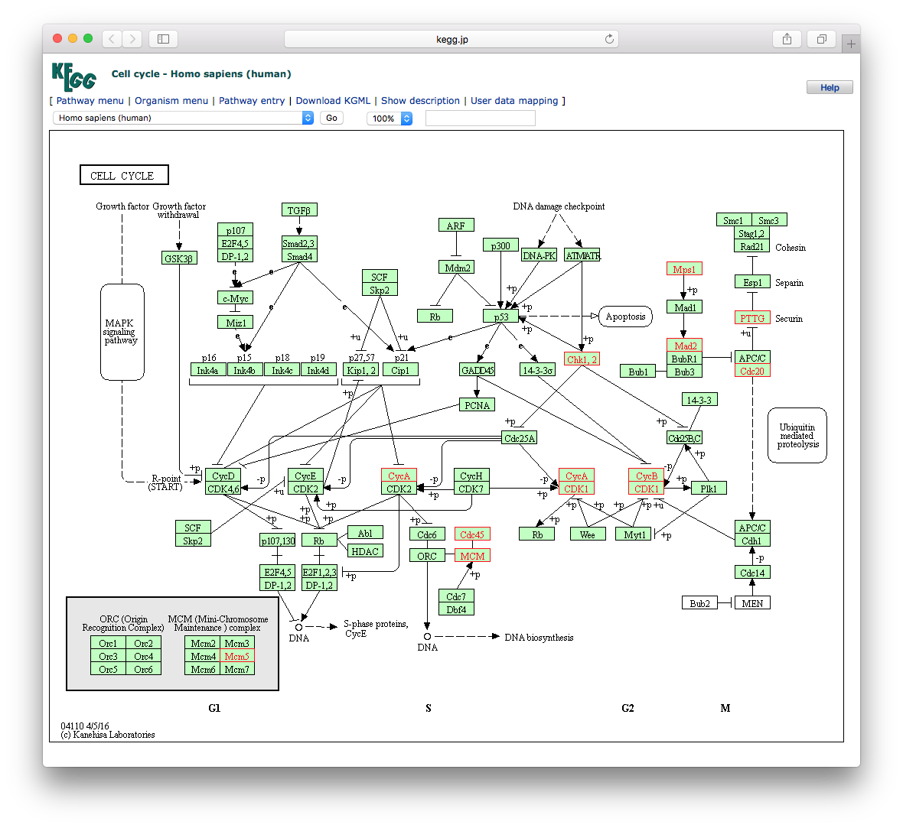
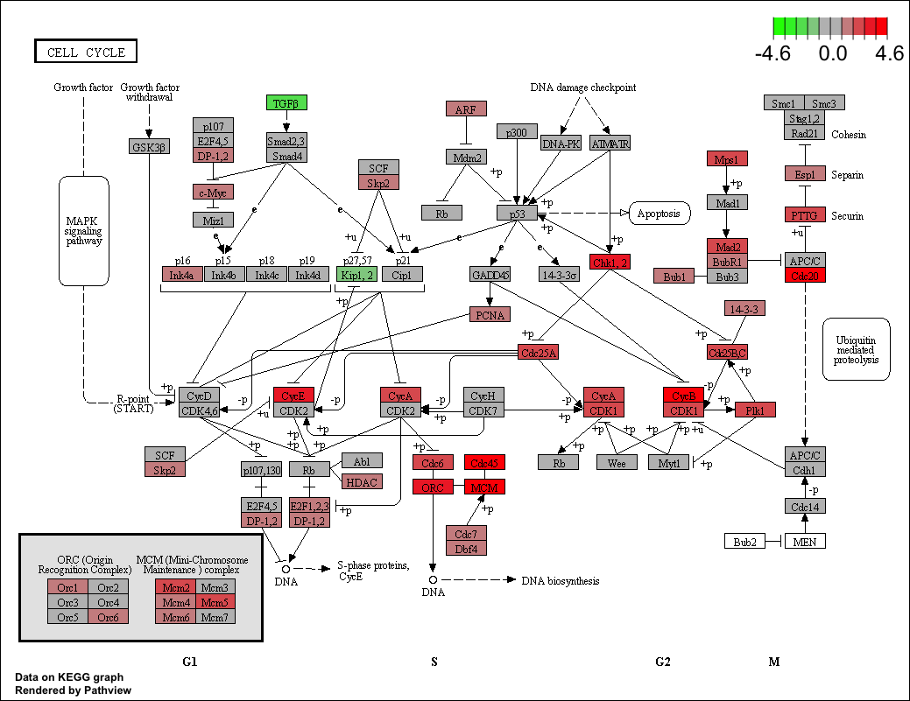

# KEGG enrichment analysis {#clusterprofiler-kegg}

```{r}
#| label: load-packages
#| echo: false
#| message: false
#| cache: false

source("_common.R")
library(clusterProfiler)
```


The KEGG FTP service has not been freely available for academic use since 2012, and there are many software packages using outdated KEGG annotation data. The `r Biocpkg("clusterProfiler")` package supports downloading the latest online version of KEGG data using the [KEGG website](https://www.kegg.jp), which is freely available for academic users. Both KEGG pathways and modules are supported in `r Biocpkg("clusterProfiler")`.


## Supported organisms {#clusterProfiler-kegg-supported-organisms}

The `r Biocpkg("clusterProfiler")` package supports all organisms that have KEGG annotation data available in the KEGG database. Users should pass an abbreviation of academic name to the `organism` parameter. The full list of KEGG supported organisms can be accessed via <http://www.genome.jp/kegg/catalog/org_list.html>. [KEGG Orthology](https://www.genome.jp/kegg/ko.html) (KO) Database is also supported by specifying `organism = "ko"`.


The `r Biocpkg("clusterProfiler")` package provides the `search_kegg_organism()` function to help search for supported organisms.

```{r}
#| label: search-kegg-organism
library(clusterProfiler)
search_kegg_organism('ece', by='kegg_code')
ecoli <- search_kegg_organism('Escherichia coli', by='scientific_name')
dim(ecoli)
head(ecoli)
```


## Finding correct parameters: A case study with Rice

The `enrichKEGG()` function requires three key parameters: `gene` (gene IDs), `organism` (species code), and `keyType` (type of gene ID). Many users struggle with determining the correct values for `organism` and `keyType`, especially for non-model organisms. Here, we use rice (*Oryza sativa*) as an example to demonstrate how to find these parameters.

### Determine the `organism` code

The `organism` parameter accepts a KEGG organism code (e.g., 'hsa' for human, 'mmu' for mouse). To find the code for your species, you can search the [KEGG Organism Catalog](http://www.genome.jp/kegg/catalog/org_list.html) or use the `search_kegg_organism()` function as mentioned above.

For rice, searching for "rice" or "Oryza sativa" in the catalog reveals two main subspecies:
* *Oryza sativa japonica* (Japanese rice) -> code: `osa`
* *Oryza sativa indica* (Indian rice) -> code: `dosa`

Choose the one that matches your data. For example, if we choose `dosa`.

### Determine the `keyType`

Once the `organism` is determined, we need to know what gene ID types (`keyType`) are supported for that organism. A practical trick is to use `enrichKEGG()` as a query tool. By inputting a dummy gene ID and a likely `keyType`, the function will return an error message listing the expected ID format if the input is invalid.

```{r eval=FALSE}
#| label: find-keyType
# Try 'kegg' as keyType with a dummy gene
enrichKEGG(gene = "abc", organism = "dosa", keyType = "kegg")
# Output:
# --> No gene can be mapped....
# --> Expected input gene ID: Os06t0664200-01,Os02t0534400-01,Os06t0185100-00...
# --> return NULL...

# Try 'ncbi-geneid'
enrichKEGG(gene = "abc", organism = "dosa", keyType = "ncbi-geneid")
# Output:
# Error in KEGG_convert("kegg", keyType, species) :
#   ncbi-geneid is not supported for dosa ...

# Try 'uniprot'
enrichKEGG(gene = "abc", organism = "dosa", keyType = "uniprot")
# Output:
# Error in KEGG_convert("kegg", keyType, species) :
#   uniprot is not supported for dosa ...
```

From the output, we learn that for `dosa`, the supported `keyType` is `kegg`, and the expected gene ID format looks like `Os06t0664200-01` (RAP-ID). For `osa`, the gene IDs are typically NCBI Gene IDs (e.g., `3131385`).

### ID Conversion

If your gene list uses a different ID type (e.g., `LOC4334374` or `LOC_Os01g01010.1`), you need to convert them to the supported KEGG ID.

For `LOC4334374`, you can use `AnnotationHub` to retrieve the rice `OrgDb` and convert symbols to Entrez IDs (which correspond to `osa` KEGG IDs).

```{r eval=FALSE}
#| label: id-conversion-ah
library(AnnotationHub)
ah <- AnnotationHub()
# Query for Oryza sativa
query(ah, 'oryza')
oryza <- ah[['AH55775']] # Example AH ID, check for latest
# Check keys
head(keys(oryza, keytype = "SYMBOL"))
# Convert SYMBOL to ENTREZID
# ...
```

For RAP-ID conversion (e.g., `LOC_Os01g01010.1` to `Os01t0100100-01`), you might need to download mapping files from the [Rice Annotation Project Database (RAP-DB)](https://rapdb.dna.affrc.go.jp/) or [Oryzabase](https://shigen.nig.ac.jp/rice/oryzabase/) and perform the conversion manually or using scripts.

### Perform Enrichment Analysis

With the correct `organism`, `keyType`, and converted gene IDs, you can now run the analysis:

```{r eval=FALSE}
#| label: enrichKEGG-rice
# For osa (using Entrez IDs)
kk <- enrichKEGG(gene         = gene_list_entrez,
                 organism     = "osa",
                 keyType      = "kegg", # or 'ncbi-geneid' if supported
                 pvalueCutoff = 0.05)

# For dosa (using RAP-IDs)
kk <- enrichKEGG(gene         = gene_list_rap,
                 organism     = "dosa",
                 keyType      = "kegg",
                 pvalueCutoff = 0.05)
```

This approach of identifying `organism` code and verifying `keyType` via error messages applies to any species available in the KEGG database.

## KEGG Data Localization

The `r Biocpkg("clusterProfiler")` package retrieves KEGG data online via the KEGG API, which ensures that users analyze their data with the latest knowledge. However, this dependency on internet access can be a limitation if the network is unstable or unavailable (e.g., in some cloud environments). Furthermore, for the sake of reproducibility, it is often desirable to freeze the KEGG data version used in an analysis.

To address these issues, we provide two methods to perform KEGG analysis locally.

### Using `gson`

The `r Biocpkg("gson")` package provides the `gson_KEGG()` function to download the latest KEGG pathway and module data for a specific organism and store it in a `GSON` object. This object contains all necessary information for enrichment analysis and can be saved to a file for offline use.

```{r eval=FALSE}
#| label: gson-kegg
library(gson)
# download KEGG data for human
kk_gson <- gson_KEGG(species = "hsa")

# save to a file
write.gson(kk_gson, file = "kegg_hsa.gson")

# read from file
kk_gson <- read.gson("kegg_hsa.gson")
```

The `GSON` object or the file can be used in `enricher()` and `GSEA()` functions (via `gson` parameter or by parsing it). For more detailed information on using the GSON format, including how to perform generalized enrichment analysis with multiple knowledge bases using `gsonList`, please refer to @sec-gson-enrichment.

### When the KEGG API is unreachable

In some server or cloud environments, direct access to the KEGG REST API may fail (for example, returning `403 Forbidden`). In such cases, `enrichKEGG()` and `gseKEGG()` may fail before the enrichment analysis starts, simply because the annotation data cannot be retrieved online.

A practical workaround is to build the KEGG annotation on another machine that has normal access to KEGG, save it locally, and then reuse it on the target server. This is also a convenient way to freeze the KEGG version used in an analysis, which helps reproducibility.

```{r eval=FALSE}
#| label: gson-kegg-offline-workaround
## on a machine that can access KEGG
kk_gson <- gson_KEGG("hsa")
saveRDS(kk_gson, file = "kegg_hsa_gson.rds")

## on the server
kk_gson <- readRDS("kegg_hsa_gson.rds")

kk <- enrichKEGG(gene = gene, organism = kk_gson)
kk2 <- gseKEGG(geneList = geneList, organism = kk_gson)
```

This approach is useful when the analysis server has unstable network access, when the KEGG API is temporarily unavailable, or when users want to freeze the exact KEGG version used in an analysis for later reproduction.

### Using `createKEGGdb`

Another approach is to create a local `KEGG.db` package containing the KEGG data. While the official `KEGG.db` has not been updated since 2011, we can generate a new one using the `createKEGGdb` package.

First, install `createKEGGdb` from GitHub:

```{r eval=FALSE}
#| label: install-createKEGGdb
remotes::install_github("YuLab-SMU/createKEGGdb")
```

Then, use `create_kegg_db()` to download data and package it. You can specify one or more species, or even "all" to download data for all supported species.

```{r eval=FALSE}
#| label: create-kegg-db
library(createKEGGdb)
# create KEGG.db for human and Arabidopsis
create_kegg_db(c("hsa", "ath"))
```

This command will generate a `KEGG.db_1.0.tar.gz` file in the current directory. Install it as a standard R package:

```{r eval=FALSE}
#| label: install-local-keggdb
install.packages("KEGG.db_1.0.tar.gz", repos=NULL, type="source")
```

Once installed, you can perform enrichment analysis using the local data by setting `use_internal_data = TRUE` in `enrichKEGG()`:

```{r eval=FALSE}
#| label: enrichKEGG-internal
library(KEGG.db)
kk <- enrichKEGG(gene         = gene,
                 organism     = 'hsa',
                 pvalueCutoff = 0.05,
                 use_internal_data = TRUE)
```

This ensures that the analysis runs offline and is fully reproducible using the installed `KEGG.db` version.

## KEGG ID Conversion {#kegg-id-conversion}

The `r Biocpkg("clusterProfiler")` package provides the `bitr_kegg()` function to support ID conversion via the KEGG API. This is particularly useful for species that do not have an `OrgDb` object but are supported by KEGG.

### Basic Usage

Here is an example of converting KEGG IDs to NCBI Protein IDs and then to UniProt IDs for human genes.

```{r}
#| label: bitr-kegg
library(clusterProfiler)
data(gcSample)
hg <- gcSample[[1]]
head(hg)

# Convert KEGG ID to NCBI Protein ID
eg2np <- bitr_kegg(hg, fromType='kegg', toType='ncbi-proteinid', organism='hsa')
head(eg2np)

# Convert NCBI Protein ID to UniProt ID
np2up <- bitr_kegg(eg2np[,2], fromType='ncbi-proteinid', toType='uniprot', organism='hsa')
head(np2up)
```

The ID type (both `fromType` and `toType`) should be one of 'kegg', 'ncbi-geneid', 'ncbi-proteinid', or 'uniprot'. The 'kegg' ID is the primary ID used in the KEGG database. A rule of thumb is that 'kegg' ID corresponds to `entrezgene` ID for eukaryote species and `Locus` ID for prokaryotes.

For many prokaryote species, `entrezgene` IDs are not available. For example, `ece:Z5100` (E. coli O157:H7 EDL933) has `NCBI-ProteinID` and `UniProt` links, but not `NCBI-GeneID`. Attempting to convert `Z5100` to `ncbi-geneid` will result in an error stating that `ncbi-geneid` is not supported. However, conversion to `ncbi-proteinid` or `uniprot` is possible.

```{r}
#| label: bitr-kegg-prokaryote
# Example for prokaryote ID conversion
bitr_kegg("Z5100", fromType="kegg", toType='ncbi-proteinid', organism='ece')
bitr_kegg("Z5100", fromType="kegg", toType='uniprot', organism='ece')
```

### Converting KO numbers to Pathways

A common confusion exists between `K` numbers (KEGG Orthology) and `ko` numbers (KEGG Pathway maps). `K` numbers represent orthologous groups, while `ko` numbers represent pathway maps. Users often want to map `K` numbers to pathways.

```{r}
#| label: bitr-kegg-path-ko
bitr_kegg("K00844", "kegg", "Path", "ko")
```

To retrieve the names of the pathways (e.g., "Glutathione metabolism" instead of "ko00480"), we can define a simple helper function `ko2name` to query the KEGG API.

```{r}
#| label: ko2name-example
x <- bitr_kegg("K00799", "kegg", "Path", "ko")
y <- ko2name(x$Path)
merge(x, y, by.x='Path', by.y='ko')
```

## KEGG pathway over-representation analysis {#clusterprofiler-kegg-pathway-ora}


```{r}
data(geneList, package="DOSE")
gene <- names(geneList)[abs(geneList) > 2]

kk <- enrichKEGG(gene         = gene,
                 organism     = 'hsa',
                 pvalueCutoff = 0.05)
head(kk)
```

Input ID type can be `kegg`, `ncbi-geneid`, `ncbi-proteinid` or `uniprot` (see also @sec-kegg-id-conversion). Unlike `enrichGO()`, there is no `readable` parameter for `enrichKEGG()`. However, users can use the `setReadable()` function (see also @sec-setReadable) if there is an `OrgDb` available for the species.

## Translating Gene IDs to Names {#sec-setReadable}

For GO analysis, the `readable` parameter controls whether to translate the IDs to human-readable gene names. This parameter is not available for KEGG analysis. However, the `setReadable()` function can translate input gene IDs to gene names if the corresponding `OrgDb` object is available.

```{r}
library(org.Hs.eg.db)
# 'kk' is the enrichKEGG result from the previous section
kk <- setReadable(kk, OrgDb = org.Hs.eg.db, keyType="ENTREZID")
head(kk)
```

## KEGG pathway gene set enrichment analysis {#clusterprofiler-kegg-pathway-gsea}

```{r}
kk2 <- gseKEGG(geneList     = geneList,
               organism     = 'hsa',
               minGSSize    = 120,
               pvalueCutoff = 0.05,
               verbose      = FALSE)
head(kk2)
```

## KEGG Pathway Classification

KEGG pathways are organized into a hierarchical structure with top-level categories such as "Metabolism", "Genetic Information Processing", "Environmental Information Processing", "Cellular Processes", "Organismal Systems", "Human Diseases", and "Drug Development". This classification helps users interpret enrichment results by providing higher-level biological context. For instance, users might be interested specifically in signaling pathways ("Environmental Information Processing") or metabolic pathways ("Metabolism") while excluding disease-related pathways.

The `r Biocpkg("clusterProfiler")` package integrates this classification information directly into the enrichment results. The output `data.frame` contains `category` and `subcategory` columns, which can be used to filter or group the results.

### Data Update Strategy

While `r Biocpkg("clusterProfiler")` queries the KEGG API for species-specific gene sets to ensure the latest data is used, the pathway classification structure is relatively stable and universal across species. To optimize performance and avoid unnecessary dependencies (e.g., web scraping packages), `r Biocpkg("clusterProfiler")` caches this classification data within the package.

To prevent this cached data from becoming outdated, the package utilizes **GitHub Actions** for automated maintenance. A workflow is triggered weekly to crawl the latest pathway classification from the KEGG website. If any discrepancies are found between the online data and the cached data, the workflow automatically creates a Pull Request to update the package. This automation ensures that the classification data in `r Biocpkg("clusterProfiler")` remains synchronized with KEGG updates efficiently and reliably.

## KEGG module over-representation analysis {#clusterprofiler-kegg-module-ora}


[KEGG Module](http://www.genome.jp/kegg/module.html) is a collection of manually defined functional units. In some situations, KEGG Modules have a more straightforward interpretation.

```{r}
#| label: kegg-module-example
mkk <- enrichMKEGG(gene = gene,
                   organism = 'hsa',
                   pvalueCutoff = 1,
                   qvalueCutoff = 1)
head(mkk)                   
```

## KEGG module gene set enrichment analysis {#clusterprofiler-kegg-module-gsea}


```{r}
mkk2 <- gseMKEGG(geneList = geneList,
                 organism = 'hsa',
                 pvalueCutoff = 1)
head(mkk2)
```


## Visualize enriched KEGG pathways

The `r Biocpkg("enrichplot")` package implements [several methods](#sec-enrichplot) to visualize enriched terms. Most of them are general methods that can be used on GO, KEGG, MSigDb, and other gene set annotations. Here, we introduce the `clusterProfiler::browseKEGG()` and `pathview::pathview()` functions to help users explore enriched KEGG pathways with genes of interest.


To view the KEGG pathway, users can use the `browseKEGG()` function, which will open a web browser and highlight enriched genes. See @fig-browseKEGG for a screenshot example.


```{r}
#| label: browseKEGG-example
#| eval: false
browseKEGG(kk, 'hsa04110')
```


 

```{r}
#| label: fig-browseKEGG
#| out-width: 100%
#| echo: false
#| fig-cap: "**Explore selected KEGG pathway.** Differentially expressed genes that are enriched in the selected pathway will be highlighted."
#| fig-scap: "Explore selected KEGG pathway."

```


Users can also use the `pathview()` function from the `r Biocpkg("pathview")` [@luo_pathview] to visualize enriched KEGG pathways identified by the `r Biocpkg("clusterProfiler")` package [@yu2012]. See @fig-pathview for a rendered pathway image.

The following example illustrates how to visualize the "hsa04110" pathway, which was enriched in our previous analysis.

```{r eval=FALSE}
#| label: pathview-example
library("pathview")
hsa04110 <- pathview(gene.data  = geneList,
                     pathway.id = "hsa04110",
                     species    = "hsa",
                     limit      = list(gene=max(abs(geneList)), cpd=1))
```

 

```{r}
#| label: fig-pathview
#| out-width: 100%
#| echo: false
#| fig-cap: "**Visualize selected KEGG pathway by `pathview()`.** Gene expression values can be mapped to gradient color scale."
#| fig-scap: "Visualize selected KEGG pathway by `pathview()`."

```


## References {-}
