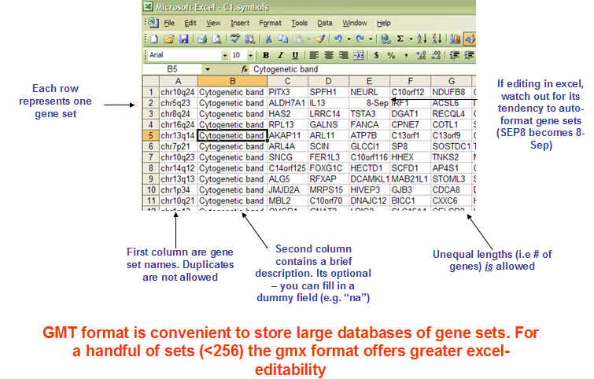

# Useful utilities {#useful-utilities}


## Translating Biological ID {#id-convert}

### `bitr`: Biological Id TranslatoR {#bitr}

The `r Biocpkg("clusterProfiler")` package provides the `bitr()` and `bitr_kegg()` functions for converting ID types. Both `bitr()` and `bitr_kegg()` support many species including model and many non-model organisms.

```{r}
x <- c("GPX3",  "GLRX",   "LBP",   "CRYAB", "DEFB1", "HCLS1",   "SOD2",   "HSPA2",
       "ORM1",  "IGFBP1", "PTHLH", "GPC3",  "IGFBP3","TOB1",    "MITF",   "NDRG1",
       "NR1H4", "FGFR3",  "PVR",   "IL6",   "PTPRM", "ERBB2",   "NID2",   "LAMB1",
       "COMP",  "PLS3",   "MCAM",  "SPP1",  "LAMC1", "COL4A2",  "COL4A1", "MYOC",
       "ANXA4", "TFPI2",  "CST6",  "SLPI",  "TIMP2", "CPM",     "GGT1",   "NNMT",
       "MAL",   "EEF1A2", "HGD",   "TCN2",  "CDA",   "PCCA",    "CRYM",   "PDXK",
       "STC1",  "WARS",  "HMOX1", "FXYD2", "RBP4",   "SLC6A12", "KDELR3", "ITM2B")
eg = bitr(x, fromType="SYMBOL", toType="ENTREZID", OrgDb="org.Hs.eg.db")
head(eg)
```

User should provides an annotation package, both `fromType` and `toType` can accept any types that supported.

User can use `keytypes` to list all supporting types.

```{r}
library(org.Hs.eg.db)
keytypes(org.Hs.eg.db)
```

We can translate from one type to other types.
```{r message=FALSE, warning=TRUE}
ids <- bitr(x, fromType="SYMBOL", toType=c("UNIPROT", "ENSEMBL"), OrgDb="org.Hs.eg.db")
head(ids)
```

For GO analysis, user don't need to convert ID, all ID type provided by `OrgDb` can be used in `groupGO`, `enrichGO` and `gseGO` by specifying `keyType` parameter.


### `bitr_kegg`: converting biological IDs using KEGG API {#bitr_kegg}


```{r message=FALSE, warning=TRUE}
data(gcSample)
hg <- gcSample[[1]]
head(hg)

eg2np <- bitr_kegg(hg, fromType='kegg', toType='ncbi-proteinid', organism='hsa')
head(eg2np)
```

The ID type (both `fromType` & `toType`) should be one of 'kegg', 'ncbi-geneid', 'ncbi-proteinid' or 'uniprot'. The 'kegg' is the primary ID used in KEGG database. The data source of KEGG was from NCBI. A rule of thumb for the 'kegg' ID is `entrezgene` ID for eukaryote species and `Locus` ID for prokaryotes.

Many prokaryote species don't have entrezgene ID available. For example we can check the gene information of `ece:Z5100` in <http://www.genome.jp/dbget-bin/www_bget?ece:Z5100>, which have `NCBI-ProteinID` and `UnitProt` links in the `Other DBs` Entry, but not `NCBI-GeneID`.


If we try to convert `Z5100` to `ncbi-geneid`, `bitr_kegg` will throw error of `ncbi-geneid is not supported`.

```{r eval=FALSE}
bitr_kegg("Z5100", fromType="kegg", toType='ncbi-geneid', organism='ece')

## Error in KEGG_convert(fromType, toType, organism) :
## ncbi-geneid is not supported for ece ...
```

We can of course convert it to `ncbi-proteinid` and `uniprot`:

```{r}
bitr_kegg("Z5100", fromType="kegg", toType='ncbi-proteinid', organism='ece')
bitr_kegg("Z5100", fromType="kegg", toType='uniprot', organism='ece')
```


## `setReadable`: translating gene IDs to human readable symbols {#setReadable}

Some of the functions, especially those internally supported for [DO](#chapter4), [GO](#chapter5), and [Reactome Pathway](#chapter8), support a parameter, `readable`.  If `readable = TRUE`, all the gene IDs will be translated to gene symbols. The `readable` parameter is not available for enrichment analysis of KEGG or using user's own annotation. KEGG analysis using `enrichKEGG` and `gseKEGG`, which internally query annotation information from KEEGG database and thus support all species if it is available in the KEGG database. However, KEGG database doesn't provide gene ID to symbol mapping information. For analysis using user's own annotation data, we even don't know what species is in analyzed. Translating gene IDs to gene symbols is partly supported using the `setReadable` function if and only if there is an `OrgDb` available. 


```{r}
library(org.Hs.eg.db)
library(clusterProfiler)

data(geneList, package="DOSE")
de <- names(geneList)[1:100]
x <- enrichKEGG(de)
## The geneID column is ENTREZID
head(x, 3)

y <- setReadable(x, OrgDb = org.Hs.eg.db, keyType="ENTREZID")
## The geneID column is translated to symbol
head(y, 3)
```

For those functions that internally support `readable` parameter, user can also use `setReadable` for translating gene IDs.


## Parsing GMT files {#read-gmt}

The GMT (Gene Matrix Transposed) file format is a tab delimited file format that is widely used to describe gene sets. Each row in the GMT format represents one gene set and each gene set is described by a name (or ID), a description and the genes in the gene set as illustrated in Figure \@ref(fig:gmtFormat).


(ref:gmtFormatscap) The GMT format..

(ref:gmtFormatcap) **The GMT format.** Figure taken from <https://software.broadinstitute.org/cancer/software/gsea/wiki/index.php/Data_formats>. 


```{r gmtFormat, out.width="100%", echo=FALSE, fig.cap="(ref:gmtFormatcap)", fig.scap="(ref:egmtFormatscap)"}

```

The `r Biocpkg("clusterProfiler")` package implemented a function, `read.gmt()`, to parse GMT file into a `data.frame`. The WikiPathway GMT file encodes information of `version`, `wpid` and `species` into the `Description` column. The `r Biocpkg("clusterProfiler")` provides the `read.gmt.wp()` function to parse WikiPathway GMT file and supports parsing information that encoded in the `Description` column. 

```{r echo=FALSE}
options(download.file.method = "wget")
options(download.file.extra = "-c")
```


```{r}
url <- "https://maayanlab.cloud/Enrichr/geneSetLibrary?mode=text&libraryName=COVID-19_Related_Gene_Sets"
download.file(url, destfile = "COVID19_GeneSets.gmt")
covid19_gs <- read.gmt("COVID19_GeneSets.gmt")
head(covid19_gs)
```


Gene set resources:

+ <https://maayanlab.cloud/Enrichr/#stats>
+ <http://ge-lab.org/#/data>


There are many gene sets available online. After parsing by the `read.gmt()` function, the data can be directly used to perform enrichment analysis using `enricher()` and `GSEA()` functions (see also [Chapter 12](#universal-api)).

## GO utilities {#go-utilities}

### drop specific GO terms or level

The `enrichGO()` function tests the whole GO corpus and enriched result may contains very general terms. With `dropGO` function, user can remove specific GO terms or GO level from results obtained from both `enrichGO()` and `compareCluster()`.


### test GO at sepcific level

The `enrichGO()` doesn't contain parameter to restrict the test at specific GO level. Instead, we provide a function, `gofilter()`, to restrict the result at specific GO level. It works with results obtained from both `enrichGO()` and `compareCluster()`.


### reduce redundancy of enriched GO terms

GO is organized in parent-child structure, thus a parent term can be overlapped with a large proportion with all its child terms. This can result in redundant findings. To solve this issue, `r Biocpkg("clusterProfiler")` implements [`simplify`](https://github.com/GuangchuangYu/clusterProfiler/issues/28) method to reduce redundant GO terms from the outputs of `enrichGO()` and `gseGO()`. The function internally called `r Biocpkg("GOSemSim")` [@yu2010] to calculate semantic similarity among GO terms and remove those highly similar terms by keeping one representative term. The `simplify()` method apply `select_fun` (which can be a user defined function) to feature `by` to select one representative term from redundant terms (which have similarity higher than `cutoff`).


In Figure \@ref(fig:simplify-emapplot)A, we can found that there are many redundant terms form a highly condense network. After removing redundant terms using the `simplify()` method, the result is more clear to view the whole story.

(ref:emapplotSimplifyscap) Visualize enriched terms by EnrichmentMap using the `emapplot()` function.

(ref:emapplotSimplifycap) **Visualize enriched terms by EnrichmentMap using the `emapplot()` function.** (A) original result. (B) simplify result. 


```{r simplify-emapplot,fig.width=16, fig.height=8, fig.cap="(ref:emapplotSimplifycap)", fig.scap="(ref:emapplotSimplifyscap)"}
data(geneList, package="DOSE")
de <- names(geneList)[abs(geneList) > 2]
bp <- enrichGO(de, ont="BP", OrgDb = 'org.Hs.eg.db')
bp2 <- simplify(bp, cutoff=0.7, by="p.adjust", select_fun=min)
p1 <- emapplot(bp)
p2 <- emapplot(bp2)
cowplot::plot_grid(p1, p2, ncol=2, labels = LETTERS[1:2])
```

Alternatively, users can use slim version of GO and use the `enricher()` o r `gseGO()` functions to analyze. 

