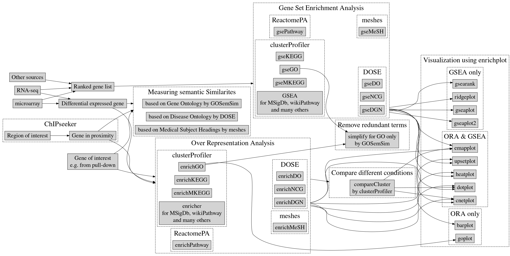

```{r include=FALSE}
CRANpkg <- function (pkg) {
    cran <- "https://CRAN.R-project.org/package"
    fmt <- "[%s](%s=%s)"
    sprintf(fmt, pkg, cran, pkg)
}

Biocpkg <- function (pkg) {
    sprintf("[%s](http://bioconductor.org/packages/%s)", pkg, pkg)
}

Githubpkg <- function (user, pkg) {
    gh <- "https://github.com"
    fmt <- "[%s](%s/%s/%s)"
    sprintf(fmt, pkg, gh, user, pkg)
}

badge_version <- function(pkg, color="green") {
    v <- packageVersion(pkg)
    url <- paste0("https://github.com/YuLab-SMU/", pkg)
    badger::badge_custom(pkg, v, color, url)
}


library(knitr)
opts_chunk$set(message=FALSE, warning=FALSE, eval=TRUE, 
    echo=TRUE, cache=TRUE, dev="CairoPNG", out.width="95%")


library(emojifont)
library(org.Hs.eg.db)
library(clusterProfiler)

#options(clusterProfiler.download.method = "wget")
```


# `r emoji("book")` Introduction {-}

`r badge_version("ChIPseeker")`
`r badge_version("clusterProfiler")`
`r badge_version("DOSE")`
`r badge_version("enrichplot")`
`r badge_version("GOSemSim")`
`r badge_version("meshes")`
`r badge_version("ReactomePA")`


hello

```{r summaryDiagram, echo=FALSE}

```

<!--
In recently years, high-throughput experimental techniques such as
microarray, RNA-Seq and mass spectrometry can detect cellular
molecules at systems-level. These kinds of analyses generate huge
quantitaties of data, which need to be given a biological
interpretation. A commonly used approach is via clustering in the gene
dimension for grouping different genes based on their similarities[@yu2010].

To search for shared functions among genes, a common way is to
incorporate the biological knowledge, such as Gene Ontology (GO) and
Kyoto Encyclopedia of Genes and Genomes (KEGG), for identifying
predominant biological themes of a collection of genes.

After clustering analysis, researchers not only want to determine
whether there is a common theme of a particular gene cluster, but also
to compare the biological themes among gene clusters. The manual step
to choose interesting clusters followed by enrichment analysis on each
selected cluster is slow and tedious. To bridge this gap, we designed
[clusterProfiler](https://www.bioconductor.org/packages/clusterProfiler)[@yu2012], for comparing and visualizing functional
profiles among gene clusters.

-->

## `r emoji("dart")` Motivation {-}

The book is meant as a guide for mining biological knowledge to elucidate or interpret molecular mechanisms using a suite of R packages, including `r Biocpkg("ChIPseeker")`, `r Biocpkg("clusterProfiler")`, `r Biocpkg("DOSE")`, `r Biocpkg("enrichplot")`, `r Biocpkg("GOSemSim")`, `r Biocpkg("meshes")` and `r Biocpkg("ReactomePA")`. Hence, if you are starting to read this book, we assume you have a working knowledge of how to use R.

## `r emoji("memo")` Citation {-}

If you use the software suite in published research, please cite the most appropriate paper(s) from this list:

1. T Wu<sup>#</sup>, E Hu<sup>#</sup>, S Xu, M Chen, P Guo, Z Dai, T Feng, L Zhou, W Tang, L Zhan, X Fu, S Liu, X Bo<sup>\*</sup>, **G Yu**<sup>\*</sup>. clusterProfiler 4.0: A universal enrichment tool for interpreting omics data. **_The Innovation_**. 2021, 2(3):100141.
doi: [10.1016/j.xinn.2021.100141](https://doi.org/10.1016/j.xinn.2021.100141)
2. __G Yu__^\*^. Gene Ontology Semantic Similarity Analysis Using GOSemSim. In: Kidder B. (eds) Stem Cell Transcriptional Networks. __*Methods in Molecular Biology*__. 2020, 2117:207-215. Humana, New York, NY.
doi: [10.1007/978-1-0716-0301-7_11](https://doi.org/10.1007/978-1-0716-0301-7_11)
3. __G Yu__^\*^. Using meshes for MeSH term enrichment and semantic analyses. __*Bioinformatics*__. 2018, 34(21):3766–3767.
doi: [10.1093/bioinformatics/bty410](https://doi.org/10.1093/bioinformatics/bty410)
4. __G Yu__, QY He^\*^. ReactomePA: an R/Bioconductor package for reactome pathway analysis and visualization. __*Molecular BioSystems*__. 2016, 12(2):477-479.
doi: [10.1039/C5MB00663E](https://doi.org/10.1039/C5MB00663E)
5. __G Yu__^\*^, LG Wang, and QY He^\*^. ChIPseeker: an R/Bioconductor package for ChIP peak annotation, comparison and visualization. __*Bioinformatics*__. 2015, 31(14):2382-2383.
doi: [10.1093/bioinformatics/btv145](https://doi.org/10.1093/bioinformatics/btv145)
6. __G Yu__^\*^, LG Wang, GR Yan, QY He^\*^. DOSE: an R/Bioconductor package for Disease Ontology Semantic and Enrichment analysis. __*Bioinformatics*__. 2015, 31(4):608-609.
doi: [10.1093/bioinformatics/btu684](https://doi.org/10.1093/bioinformatics/btu684)
7. __G Yu__, LG Wang, Y Han and QY He^\*^. clusterProfiler: an R package for comparing biological themes among gene clusters. __*OMICS: A Journal of Integrative Biology*__. 2012, 16(5):284-287.
doi: [10.1089/omi.2011.0118](https://doi.org/10.1089/omi.2011.0118)
8. __G Yu__, F Li, Y Qin, X Bo^\*^, Y Wu, S Wang^\*^. GOSemSim: an R package for measuring semantic similarity among GO terms and gene products. __*Bioinformatics*__. 2010, 26(7):976-978.
doi: [10.1093/bioinformatics/btq064](https://doi.org/10.1093/bioinformatics/btq064)


## `r emoji("books")` Book structure {-}

+ Part 1 (Semantic similarity analysis) describes `r Biocpkg("GOSemSim")`, `r Biocpkg("DOSE")` and `r Biocpkg("meshes")` packages for measuring semantic similarity of genes or gene products based on Gene Ontology, Disease Ontology and Medical Subject Headings.
+ Part 2 (Enrichment analysis) introduces over-reprensentation analysis and gene set enrichment analysis using `r Biocpkg("clusterProfiler")` (supports GO, KEGG, MSigDb, WikiPathway, and many others via universal interface), `r Biocpkg("DOSE")` (DO, Disease-Gene Network, Network of Cancer Genes), `r Biocpkg("meshes")` (MeSH), and `r Biocpkg("ReactomePA")` (Reactome pathway). Functional enrichment analysis of Genomic coordination is supported via `r Biocpkg("ChIPseeker")` and comparison among multiple conditions is also supported by `r Biocpkg("clusterProfiler")`. We implemented a number of visualization methods in the `r Biocpkg("enrichplot")` package to help users to interpret their results. 
+ Part 3 (Miscellaneous topics) describes useful utilities including translating gene IDs and manipulating enrichment results.

## `r emoji("sparkling_heart")` Want to help? {-}


The book’s source code is hosted on GitHub, at <https://github.com/YuLab-SMU/biomedical-knowledge-mining-book>. Any feedback on the book is very welcome. Feel free to [open an issue](https://github.com/YuLab-SMU/biomedical-knowledge-mining-book/issues/new) on GitHub or send me a pull request if you notice typos or other issues (I'm not a native English speaker ;) ).
