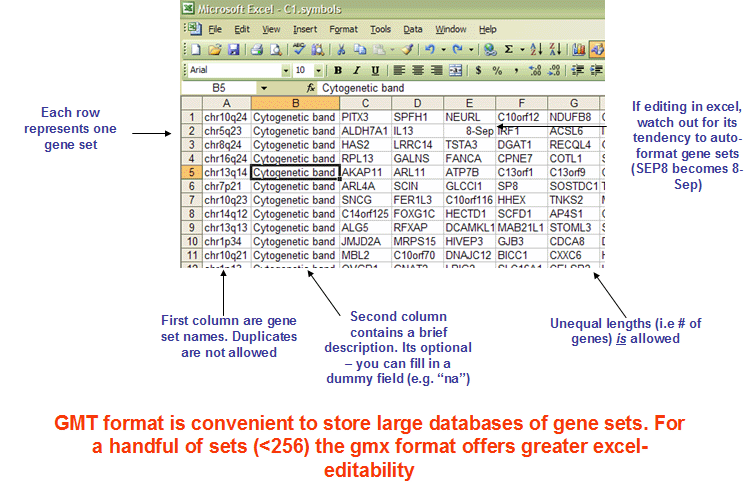

# Useful utilities {#useful-utilities}


```{r}
#| echo: false
#| message: false
#| cache: false

source("_common.R")
library(clusterProfiler)
library(enrichplot)
```

## Translating Biological ID {#sec-id-convert}

### `bitr`: Biological Id TranslatoR {#bitr}

The `r Biocpkg("clusterProfiler")` package provides the `bitr()` and `bitr_kegg()` functions for converting ID types. Both `bitr()` and `bitr_kegg()` support many species including model and many non-model organisms.

```{r}
x <- c("GPX3",  "GLRX",   "LBP",   "CRYAB", "DEFB1", "HCLS1",   "SOD2",   "HSPA2",
       "ORM1",  "IGFBP1", "PTHLH", "GPC3",  "IGFBP3","TOB1",    "MITF",   "NDRG1",
       "NR1H4", "FGFR3",  "PVR",   "IL6",   "PTPRM", "ERBB2",   "NID2",   "LAMB1",
       "COMP",  "PLS3",   "MCAM",  "SPP1",  "LAMC1", "COL4A2",  "COL4A1", "MYOC",
       "ANXA4", "TFPI2",  "CST6",  "SLPI",  "TIMP2", "CPM",     "GGT1",   "NNMT",
       "MAL",   "EEF1A2", "HGD",   "TCN2",  "CDA",   "PCCA",    "CRYM",   "PDXK",
       "STC1",  "WARS",  "HMOX1", "FXYD2", "RBP4",   "SLC6A12", "KDELR3", "ITM2B")
eg = bitr(x, fromType="SYMBOL", toType="ENTREZID", OrgDb="org.Hs.eg.db")
head(eg)
```

Users should provide an annotation package, and both `fromType` and `toType` can accept any supported types.

Users can use `keytypes` to list all supported types.

```{r}
library(org.Hs.eg.db)
keytypes(org.Hs.eg.db)
```

We can translate from one type to other types.
```{r message=FALSE, warning=TRUE}
library(clusterProfiler)
ids <- bitr(x, fromType="SYMBOL", toType=c("UNIPROT", "ENSEMBL"), OrgDb="org.Hs.eg.db")
head(ids)
```

For GO analysis, users don't need to convert IDs, as all ID types provided by `OrgDb` can be used in `groupGO`, `enrichGO`, and `gseGO` by specifying the `keyType` parameter.


Users can use the `bitr` function to convert IDs using any ID types available in the `OrgDb` object. For example, users may want to know the genes in the background that belong to a specific GO term. Such information can be easily accessed using `bitr`.

```{r}
m <- bitr("GO:0006805", fromType="GO", toType = "SYMBOL", OrgDb=org.Hs.eg.db)
dim(m)
head(m)
```

Note: If you want to extract genes in your input gene list that are belong to a specific term/pathway, you can use the [geneInCategory](#how-to-extract-genes-of-a-specific-termpathway) function.


### `bitr_kegg`: converting biological IDs using KEGG API {#sec-bitr_kegg}

The `bitr_kegg()` function supports ID conversion via the KEGG API, which is useful for species supported by KEGG but lacking an `OrgDb` object. For detailed usage and examples, please refer to the [KEGG ID Conversion](#kegg-id-conversion) section in the KEGG analysis chapter.


## `setReadable`: translating gene IDs to human readable symbols {#sec-setReadable}

Some of the functions, especially those internally supported for [DO](#dose-enrichment), [GO](#clusterprofiler-go), and [Reactome Pathway](#reactomepa), support a parameter, `readable`.  If `readable = TRUE`, all the gene IDs will be translated to gene symbols. The `readable` parameter is not available for enrichment analysis of KEGG or using user's own annotation. KEGG analysis using `enrichKEGG` and `gseKEGG`, which internally query annotation information from KEEGG database and thus support all species if it is available in the KEGG database. However, KEGG database doesn't provide gene ID to symbol mapping information. For analysis using user's own annotation data, we even don't know what species is in analyzed. Translating gene IDs to gene symbols is partly supported using the `setReadable` function if and only if there is an `OrgDb` available. The `setReadable()` function also works with `compareCluster()` output. 


```{r}
data(geneList, package="DOSE")
de <- names(geneList)[1:100]
x <- enrichKEGG(de)
## The geneID column is ENTREZID
head(x, 3)

y <- setReadable(x, OrgDb = org.Hs.eg.db, keyType="ENTREZID")
## The geneID column is translated to symbol
head(y, 3)
```

For those functions that internally support `readable` parameter, user can also use `setReadable` for translating gene IDs.


## Parsing GMT files {#read-gmt}

The GMT (Gene Matrix Transposed) file format is a tab delimited file format that is widely used to describe gene sets. Each row in the GMT format represents one gene set and each gene set is described by a name (or ID), a description and the genes in the gene set as illustrated in @fig-gmtFormat.


```{r}
#| label: fig-gmtFormat  
#| echo: false
#| out-width: "100%"
#| fig-scap: |
#|   The GMT format.
#| fig-cap: |
#|   **The GMT format.** Figure taken from <https://software.broadinstitute.org/cancer/software/gsea/wiki/index.php/Data_formats>.
#| 

```

The `r Biocpkg("clusterProfiler")` package implemented a function, `read.gmt()`, to parse GMT file into a `data.frame`. The WikiPathway GMT file encodes information of `version`, `wpid` and `species` into the `Description` column. The `r Biocpkg("clusterProfiler")` provides the `read.gmt.wp()` function to parse WikiPathway GMT file and supports parsing information that encoded in the `Description` column. 


```{r}
# use `wget -c` in `download.file`
wget::wget_set()
url <- "https://maayanlab.cloud/Enrichr/geneSetLibrary?mode=text&libraryName=COVID-19_Related_Gene_Sets"
download.file(url, destfile = "COVID19_GeneSets.gmt")

covid19_gs <- read.gmt("COVID19_GeneSets.gmt")
head(covid19_gs)
```


Gene set resources:

+ <https://maayanlab.cloud/Enrichr/#stats>
+ <http://ge-lab.org/#/data>


There are many gene sets available online. After parsing by the `read.gmt()` function, the data can be directly used to perform enrichment analysis using `enricher()` and `GSEA()` functions (see also [Chapter 12](#universal-api)).


## Data frame interface for accessing enriched results

Enrichment result objects in `clusterProfiler` support standard data frame operations including `[`, `[[`, and `$` operators, allowing users to subset and access results using familiar data frame syntax.

### Subsetting with `[` operator

The `[` operator can be used to subset enrichment results based on row indices or logical conditions:

```{r}
# Subset first 5 rows
x_first5 <- x[1:5, ]

# Subset based on p-value threshold
x_sig <- x[x$pvalue < 0.05, ]

# Subset specific terms by ID
x_specific <- x[x$ID %in% c("DOID:0060071", "DOID:5295"), ]
```

By default, the `[` operator returns a `data.frame`. To preserve the enrichment result object structure for further analysis and visualization, use the `asis = TRUE` parameter:

```{r}
# Preserve as enrichResult object
x_filtered <- x[x$pvalue < 0.05, asis = TRUE]
class(x_filtered)
```

### Accessing columns with `[[` and `$` operators

The `[[` and `$` operators provide convenient access to specific columns:

```{r}
# Access Description column using $
descriptions <- x$Description
head(descriptions)

# Access p-value column using [[
pvalues <- x[["pvalue"]]
head(pvalues)

# Access geneID column
gene_ids <- x$geneID
head(gene_ids)
```

### Practical filtering examples

Users can filter enrichment results based on various criteria:

```{r}
# Filter by adjusted p-value
x_padj <- x[x$p.adjust < 0.05, asis = TRUE]

# Filter by gene count (minimum 5 genes per term)
x_min5 <- x[x$Count >= 5, asis = TRUE]

# Filter specific biological processes
x_bp <- x[grepl("process", x$Description, ignore.case = TRUE), asis = TRUE]

# Filter terms containing specific genes
x_containing_gene <- x[grepl("6280", x$geneID), asis = TRUE]
```

This data frame interface provides flexible filtering capabilities while maintaining compatibility with `enrichplot` visualization functions when using `asis = TRUE`.

## Alternative filtering approaches with dplyr

While base R operators provide familiar syntax for filtering enrichment results, users may prefer the more readable and chainable approach offered by `dplyr` verbs. For comprehensive examples of using `filter`, `arrange`, `select`, `mutate`, and other dplyr functions with enrichment result objects, please refer to the [dplyr verbs for manipulating enrichment result](#clusterProfiler-dplyr) chapter.

The `dplyr` approach is particularly useful for complex filtering operations and pipeline-style data manipulation.

## References {-}
